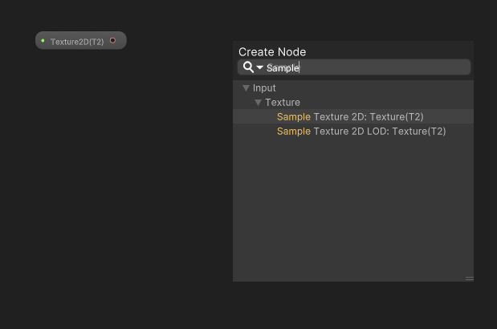
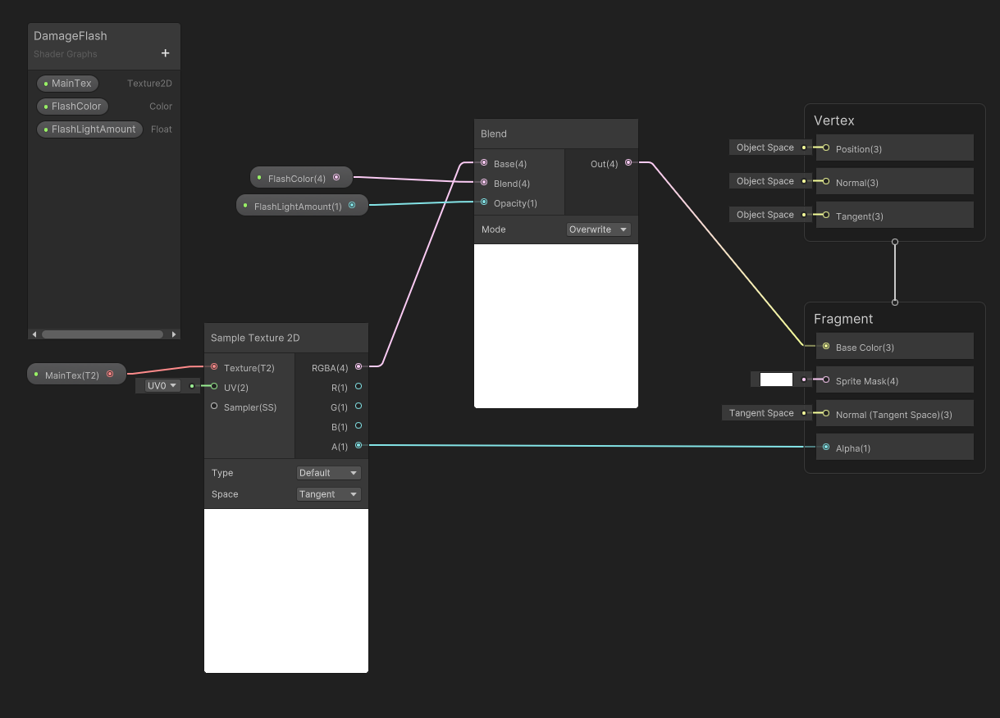

# 페이지 작성중

게임을 하다보면... 캐릭터가 맞을 때 하얘진다! 아파서 하얗게 질리는건가? ㅋㅋㅋㅋㅋㅋㅋㅋ

...그런 의미에서 만들어 보기로 했다.
# 기준
1. Unity 2021.3.10f1 Personal
2. URP 사용

빨리빨리 구현만 하고싶을 수 있기에 세부 내용은 접어뒀다.

보고 싶다면 [펼치기] 모양을 누르도록 하자.

## 쉐이더 만들기

Project 윈도우를 우클릭하고 

Create - Shader Graph - URP - Srpite Lit Shader Graph

 

 

만들어진 파일을 더블클릭해서 열고, 화면 왼쪽에 보이는 + 누르고 Texture 2D 생성... 이런 식으로 쉐이더 그래프 변수들을 만들 수 있음!

 

만들어진 노드의 o모양 점을 허공으로 끌어다 두면 Create Node 창이 뜸

거기서 Sample만 치면 Sample로 시작하는 두가지가 뜨는데 그중에 **Sample Texture 2D: Texture(T2)** 이거 클릭... 이런 식으로 노드를 추가할 수 있음!

또, 노드끼리 o점을 이어서 연결 가능.

이런 방법을 통해서 요런 모양으로 만들기(누르면 커짐! 모바일이면... 어...)

[펼치기] 각 노드 설명

## 스크립트 만들기

## 메테리얼(Material) 만들기

## 오브젝트에 적용시키기
