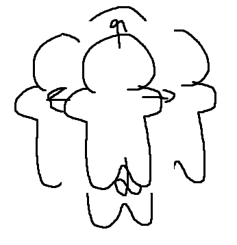
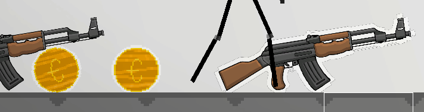
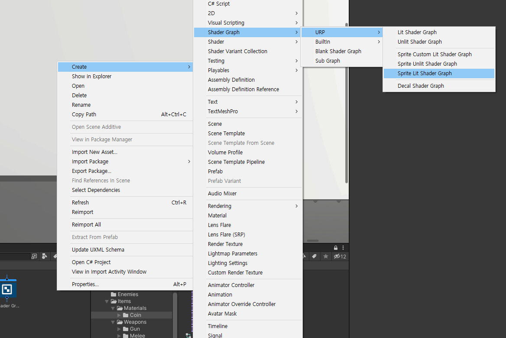
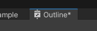
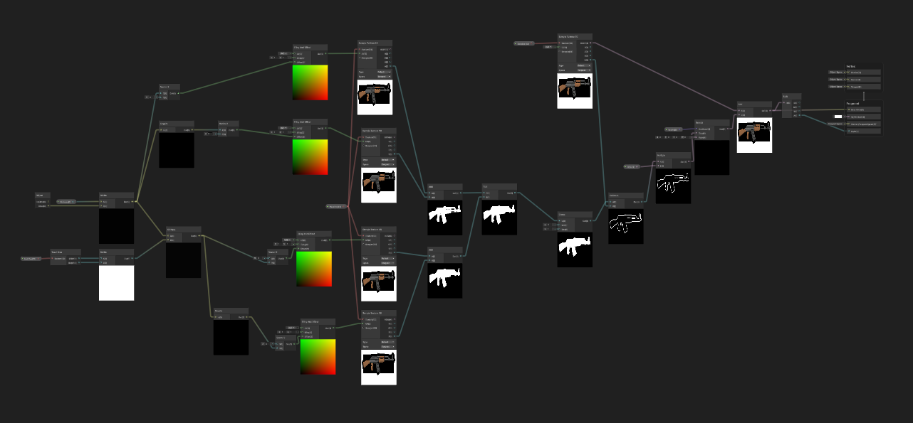
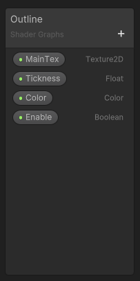
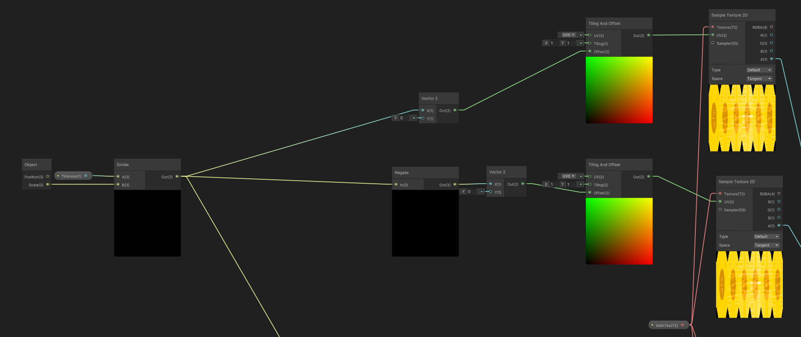
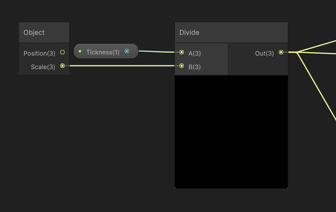
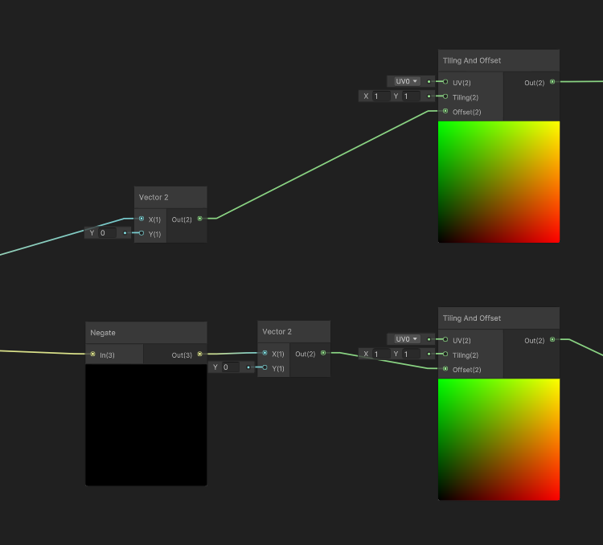

## 다룰 문제들
당근 빳다로다가 제목에 쓴 것처럼 스프라이트의 외곽선을 만들어 볼 것이다. 
여기서 사용하는 방식은 텍스쳐를 복사한 후, 약간 이동시켜 외곽선으로 만드는 것이다

이런... 느낌이다.

결과를 미리 보자면 이런 모습이다.

내 생각에 이 방법은 도트 쪽에 가장 어울릴 것 같다. 이 방법에서 몇가지 노드를 떼어버리면 정말 도트 한칸씩 추가된 외곽선을 만들 수 있다.

- 쉐이더 그래프를 이용한 외곽선 생성
- 가로 세로 일정한 비율로 늘어나는 외곽선
- 스케일이 바뀌어도 일정한 외곽선
- 특정 조건에서만 생기는 외곽선

## 환경
1. Unity 2021.3.10f1 Personal
2. URP 사용
3. 영어 버전(메뉴 영어)
4. 2D, Sprite

## 쉐이더 그래프를 이용한 외곽선 생성

### 파일 생성
우선 쉐이더 그래프를 파일을 만들어주자.

프로젝트 창 우클릭 -> Create -> Shader Graph -> URP -> Sprite Lit Shader Graph

들은 바로는 unlit이어도 상관 없다고 한다. 대략 광원에 영향을 받고자 한다면 lit으로,아니면 unlit으로 하는 것 같다. 나중에 만들고서 해당 쉐이더 파일을 열고, Graph Inspector -> Universal -> Material에서 바꿀 수 있는 것 같으니까 아무거나 하자.

만들었다면 만든 쉐이더 그래프 파일을 더블클릭하여 쉐이더 그래프 창을 열자. 

 

이렇게 튀어나온 걸 더블클릭하면 전체화면으로 바꿀 수 있다. 해제도 똑같다. 쉐이더 그래프를 쓸 땐 크게 해놓고 하는 게 편하다.

이 밑의 사진은 빛나는 효과를 제외한 윤곽선 생성의 전체 쉐이더 그래프다. 확대해도 화질이 낮아 안보이니 밑에 이어서 올리는 사진을 보라. 

### 쉐이더 그래프 변수 선언
우선 쉐이더 그래프 변수부터 만들자.

옆에 +기호를 눌러서 만들 수 있다. 설마 못찾진 않겠지만 화면 왼쪽에 떠있다.

thickness다...

### 그래프 구성

#### x축 방향 복사

우선 위 그래프는 x축 방향으로 스크립트를 복사한다. 

나눠서 봐보자.

Object는 해당 머티리얼이 적용된 오브젝트의 값을 받아올 수 있는 것이다. 이것을 이용하면 오브젝트의 스케일을 바꿔도 외곽선의 굵기는 그대로 적용되도록 할 수 있다.
만약, (스케일 값이) 작은

Vector2와 Negate에 X, In값은 Divide(Out(3))에서 들어왔다.
Vector2는 말 그대로 벡터값을 지정해 주는 기능을 하고, Negate는 -를 곱해준다 바꿔준다. x축 오른쪽으로는 양수고, 왼쪽은 음수니 양방향을 위해 같은 노드를 Negate를 거치고 진행해주는 것이다.

#### ㅁㄴㅇㄹ

