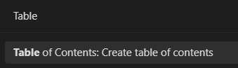

## 서론

전부 무료, 옵시디언 왼쪽 아래에 있는 톱니바퀴 -> 커뮤니티 플러그인에서 다운 가능.

## Remotely Save

```뭐라고? 온라인 저장소를 쓸 수 있다고? 무료로? 이거 완존 캡짱 아니냐```

라는 플러그인. 이름처럼 드롭박스를 통해 온라인 세이브가 가능하다.

이거 없으면 난 못 살아요.


## Excalidraw

```아 그림으로 설명해주세요```


이때 필요한 플러그인. 그림판이라고 보면 된다. Remotely Save를 통해서 그림 파일도 같이 업로드 된다.

## Table of Contents

```목차 만들기 세상 귀찮네```

이것을 해결해주는 플러그인. 옵시디언에서 쭉쭉 문서를 쓰다보면 한 문서가 좀 길어져서 목차가 필요할 때가 있다. 그때 쓰자. 헤더(#~~~) 을 기준으로 구분해준다.





